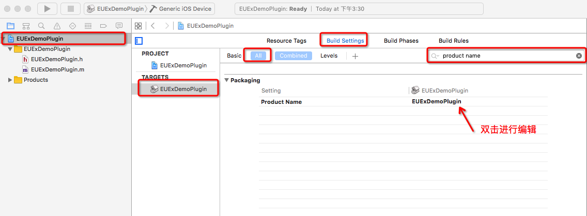
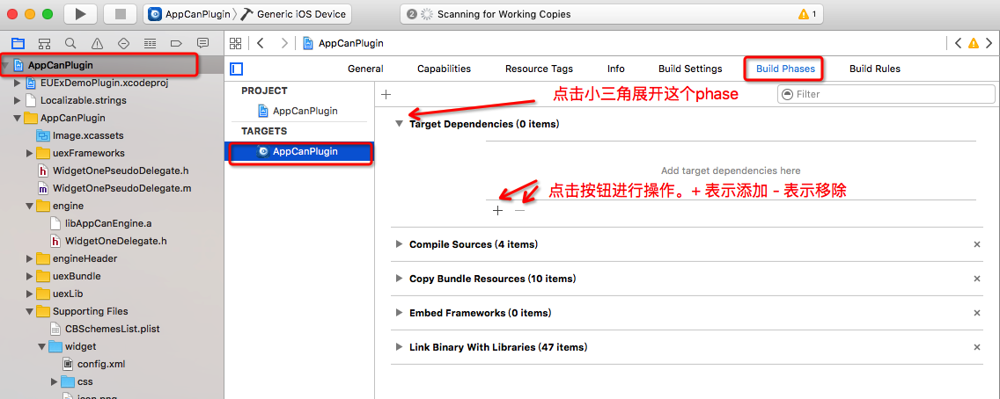
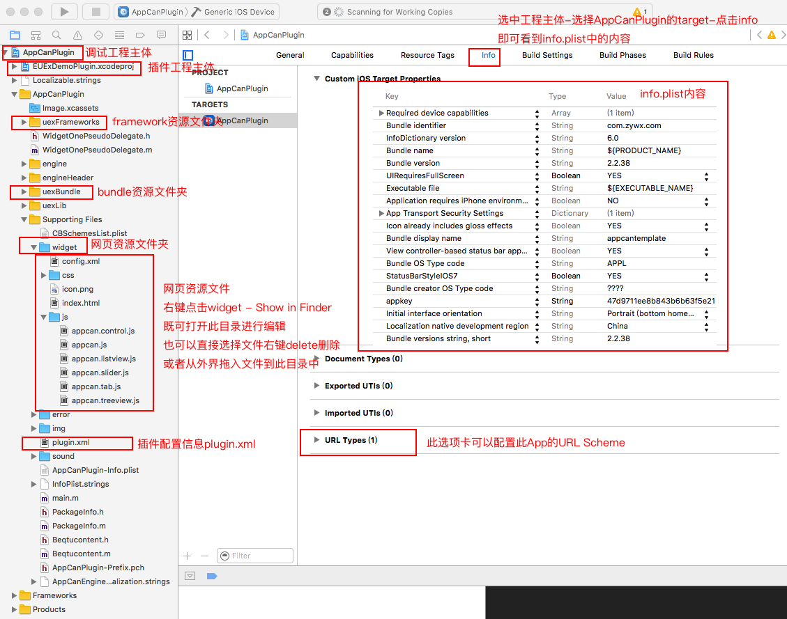
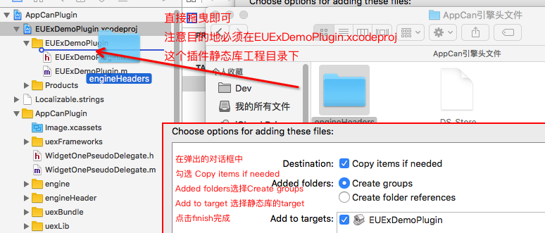
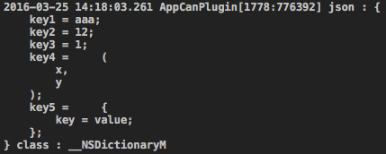
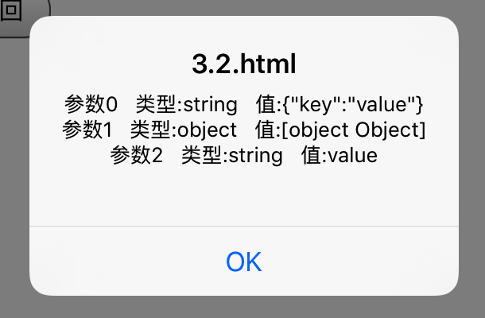
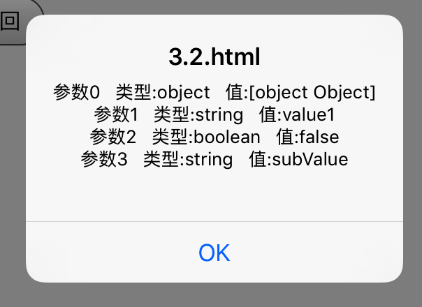
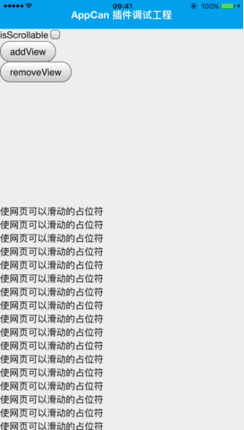
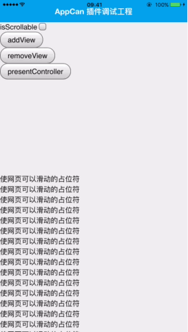
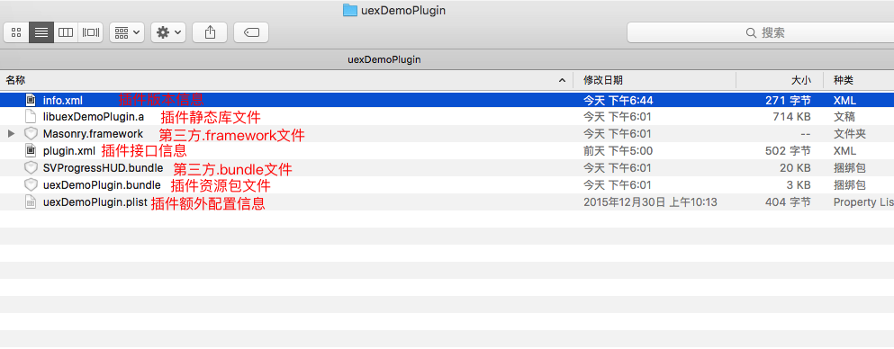

[TOC]

#iOS Native 插件开发指南

`last update:2016-03-25`

## 1.概述
	
* 本文档主要介绍了如何进行AppCan iOS原生插件开发。

### 1.1面向的读者
* 在您阅读此文档时，我们假定您已经具备了基础的iOS应用开发经验，并能够理解相关基础概念。
* 此外,您也应该对HTML,JavaScript,CSS等有一定的了解,并且熟悉在JavaScript和Objective-C环境下的JSON格式数据操作。

### 1.2开发环境需求
* OS X 10.10+
* Xcode 7.0+
* AppCan iOS插件开发包([git地址](https://github.com/AppCanOpenSource/appcan-plugin-demo-ios))


## 2.插件开发的准备工作

	以下以开发一个范例插件DemoPlugin为例，为您介绍如何进行iOS插件开发

在本文档中，会用 *斜体字* 表示那些**不是必须，但我们强烈推荐您这样做的操作**。

###2.1 创建静态库工程


* 打开Xcode,在菜单栏中选择 File - New - Project...
* 选择 iOS - Framework & Library - Cocoa Touch Static Library
* 填入您的插件基本信息,*Product Name填`EUExDemoPlugin`(**注1**)*,点击Next
* 选择静态库工程的保存地址，点击create，建立一个静态库工程
* 编辑EUExDemoPlugin这个target的Build Settings如下(**注2**):
	* 将`Product Name`对应的值修改为 `uexDemoPlugin`(**注3**)
	* *将`Pre-configuration Build Products Path` 修改为`$SRCROOT/uexDemoPlugin`(**注4**)*

* *编辑EUExDemoPlugin这个target的Build Phases,找到`Copy Files`这个phase,清空其Subpath设置,移除下面列表中的.h文件*

**注1**: 此处静态库工程的命名规则为 `EUEx + 插件名称`，之后出现的`EUExDemoPlugin`亦是如此。

**注2**: 修改target的BuildSettings的方法如下图所示，选中工程主体-选择指定的target-选择BuildSettings-选中all,然后在右上角搜索框中搜索相应的键,双击编辑对应的值
 

**注3**: 此处Product Name 的命名规则为 `uex + 插件名称`，之后出现的`uexDemoPlugin`亦是如此。

**注4**: 此设置使得工程编译得到的.a文件会生成在工程目录下的`uexDemoPlugin`文件夹中，方便后续的插件打包

### 2.2 编辑插件调试工程

* 关闭刚刚创建的静态库工程，从AppCan iOS插件开发包中找到`调试插件的工程模板`，复制一份到本地目录
* 打开工程模板中的调试工程AppCanPlugin.xcodeproj,将刚刚创建的静态库工程EUExDemoPlugin.xcodeproj引入此调试工程(直接拖拽即可,注意引入之前要确认静态库工程已经被关闭)
* 编辑主工程AppCanPlugin这个target的Build Phases如下(注1):
	* Target Dependencies 中,添加插件工程的`EUExDemoPluin`的target
	* Link Binary With Libraries中,添加`libeuxDemoPlugin.a`(注2）

**注1**:
编辑Build Phases方法如下图所示:选中工程主体-选择target-选择Build Phases - 展开相应的Phase - 点击下方的按钮进行相应的操作
 
 
**注2**:
编辑完成后应该如下图所示:
 

### 2.3 插件调试工程简介

见下图，红框标注部分都是在插件开发调试中可能会用到的部分。



	好了，到此，前期的准备工作就已经完成了，可以正式开始插件开发了!
	
	
## 3.开始插件开发

	所有的开发和调试工作，都可以直接在刚刚建立的插件调试工程中进行!
	
### 3.1 编写插件入口类

* 在AppCan插件开发包中,打开`AppCan引擎头文件`文件夹，找到engineHeader，将此文件夹引入插件工程，如下图所示

* 新建插件入口类EUExPlugin。如果你的插件静态库工程名就是EUExDemoPlugin，那么这个类应该已经自动生成了，此步可跳过。
* 在EUExDemoPlugin这个类的头文件中引入`EUExBase.h` 并使得EUExDemoPlugin类继承自EUExBase
* *在此类中实现生命周期方法`initWithBrwView:`和`clean`*

```
- (instancetype)initWithBrwView:(EBrowserView *)eInBrwView
{
    self = [super initWithBrwView:eInBrwView];
    if (self) {
        //NSLog(@"插件实例被创建");
    }
    return self;
}

- (void)clean{
    //NSLog(@"网页即将被销毁");
}
```

#####插件中类的命名规则
	
* 插件的入口类**必须**命名为`EUEx`开头的类名;
* 插件中其他的类**无命名限制，但建议增加独特的前缀**，以避免和引擎以及其他插件中的类产生类名冲突，导致打包失败

#####EUExBase.h简介

* EUExBase是AppCan插件入口的基类，所有的插件入口类都必须继承自此类。
* EUExBase拥有1个实例变量和3个实例方法
* 实例变量`meBrwView`是一个**弱引用**，指向了AppCan的网页对象。任何对网页的操作都会通过此对象进行。
* 实例方法`initWithBrwView:`是默认的初始化方法。
	* 每当一个网页里调用某插件的方法时(比如uexDemoPlugin.test();),都会先去寻找插件的入口实例(EUExDemoPlugin),如果不存在，则会通过此方法创建一个新的实例并持有它。
	* 对于同一个插件,每个网页里只会有一个插件实例，但不同的网页会拥有不同的插件实例。
	* 插件子类可以覆写此方法进行自定义初始化设置，但必须调用父类的此方法
* 实例方法`clean` 会在网页被关闭前调用
	* 插件子类可以覆写此方法进行必要的清除工作，比如停止NSTimer,关闭网络连接等等。
	* 在此方法被调用后，插件不应该再使用self.meBrwView对网页进行任何操作。
	* 在此方法被调用后, 除非特殊情况，不要让插件实例被其他任何类强硬用，否则很有可能会造成内存问题。
* 实例方法`absPath:`用于转换AppCan协议路径(`res://`,`wgt://`等)至绝对路径。

### 3.2 插件和网页进行交互

####3.2.1 暴露接口给网页
	本小节示范了如何让网页JS去调用一个原生的方法helloWorld，实现 JavaScript --> OC 的操作
	
* 在EUExDemoPlugin类中实现一个方法`helloWorld:`

```
- (void)helloWorld:(NSMutableArray *)inArguments{
    //打印 hello world!
    NSLog(@"hello world!");
}
```
#####插件入口类中实现供网页调用的方法的注意事项

	1.注意所有供网页调用的方法必须带有一个类型为NSMutableArray类型的参数
	2.引擎默认是在主线程异步调用插件方法，因此需要长时间耗时的阻塞操作,最好放在非主线程中进行，以免造成App卡死。

* 在主工程的plugin.xml中添加此接口的信息，规则如下


```
<?xml version="1.0" encoding="utf-8" ?>
<uexplugins>
    <plugin name="uexDemoPlugin">
        <method name="helloWorld"></method>
    </plugin>
</uexplugins>
```

#####plugin.xml中注册插件方法的基本规则
	1.每一个插件唯一对应了一个`<plugin>`节点,节点中必须声明此插件的名字 用`name`字段表示
	2.在插件<plugin>节点内，每个 `<method>`节点对应了一个暴露给网页的插件方法,方法名字用`name`字段表示

* 在网页中写一个按钮,在点击按钮的JS事件中调用`uexDemoPlugin.helloWorld();`

html部分

```
<input type="button" value="helloWorld" onclick="helloWorld();"/>
```

JavaScript部分

```
var helloWorld = function(){
    uexDemoPlugin.helloWorld();
}
```

* 好了 让我们运行工程，点击按钮看一下效果吧！


####3.2.2 网页传值给原生环境

	本小节示范了如何从网页传值给原生环境
	
* 在EUExDemoPlugin类中实现一个方法`sendValue:`

```
- (void)sendValue:(NSMutableArray *)inArguments{
    //打印传入的参数个数
    NSLog(@"arguments count : %@",@(inArguments.count));
    //打印每个参数的描述，和参数所在的类的描述
    for (NSInteger i = 0; i < inArguments.count; i++) {
        id obj = inArguments[i];
        NSLog(@"value : %@ , class : %@ ",[obj description],[[obj class] description]);
    }
}
```
* 在plugin.xml中添加方法

```
<?xml version="1.0" encoding="utf-8" ?>
<uexplugins>
    <plugin name="uexDemoPlugin">
        <method name="helloWorld"></method>
        <method name="sendValue"></method>
    </plugin>
</uexplugins>
```

* 在网页中调用的JS如下

```
uexDemoPlugin.sendValue("aaa",12,true,["x","y"],{key:"value"});
```
* 结果如下


#####JaveScript-->OC传值的转换规则
由上述例子可以看到,JSValue按照如下规则转换成了NSObject

| JSValue | NSObject |
| ----- | ----- |
| String | NSString |
| Number | NSNumber |
| Boolean | NSNumber |
| Array | NSArray |
| Object | NSDictionary |
| null,undefined| NSNull|
| Function | 不支持*|

*: 任何function都会被转换成一个空的NSDictionary，其所有信息都会丢失；


#### 3.2.3 网页传递JSON数据给原生环境
```
上述直接传值在Android方面会引起诸多兼容性问题，并且后续的拓展性较差。因此建议统一采用JSON数据格式进行传值。
AppCan引擎内封装了SBJSON库用于JSON的解析,之后的示例代码都会采用这个库进行JSON的序列化/反序列化。
当然,如果您偏好其他的JSON解析方法，只需要替换其中的JSON解析步骤即可，完全没有任何影响。

```

* 从AppCan插件开发包的`AppCan引擎头文件`文件夹中找到`JSON`文件夹(这个文件夹中包含了SBJSON库的头文件),引入静态库工程。在EUExDemoPlugin类中引入`JSON.h`
* 在EUExDemoPlugin类中实现一个方法`sendJSONValue:`,并在config.xml中添加相应的方法。

```
- (void)sendJSONValue:(NSMutableArray *)inArguments{
    if([inArguments count] < 1){
        //当传入的参数为空时，直接返回，避免数组越界错误。
        return;
    }
    id json = [inArguments[0] JSONValue];
    NSLog(@"json : %@ class : %@",[json description],[[json class] description]);
}
```

* 在网页中调用的JS如下

```
var json = {
 	key1:"aaa",
 	key2:12,
 	key3:true,
 	key4:["x","y"],
 	key5:{key:"value"}
}
uexDemoPlugin.sendJSONValue(JSON.stringify(json));
```
* 结果如下



可以看到JSON传值依旧遵循了[JaveScript-->OC传值的转换规则](#JaveScript-->OC传值的转换规则)

#### 3.2.4 原生异步回调JS给网页

```
此小节示范了如何通过EUtility工具类中的方法执行网页中的JS,实现OC --> JavaScript 的操作
异步回调的本质是执行一段JS脚本
```

* 在EUExDemoPlugin类中引入`EUtility.h`,这个头文件在engineHeader文件夹中，之前就应该已经引入工程了。
	* EUtility是引擎中的工具类，此类中主要封装了原生操作网页的一系列方法。
	* 由于方法较多，这里就不一一解释了,可以直接参看EUtility.h中的方法注释。
	* 如果`EUtility.h`中报`Expected a Type`错误，在`EUtility.h`中引入系统库UIKit(`#import <UIKit/UIKit.h>`)即可解决

```
//EUtility.h中和JS相关的方法有4个
//在指定网页中执行JS脚本
+ (void)brwView:(EBrowserView*)inBrwView evaluateScript:(NSString*)inScript;
//在主窗口中执行JS脚本
+ (void)evaluatingJavaScriptInRootWnd:(NSString*)script;
//在最顶端的窗口中执行JS脚本
+ (void)evaluatingJavaScriptInFrontWnd:(NSString*)script;
//以及对上述3个方法的进一步封装
+ (void)uexPlugin:(NSString *)pluginName callbackByName:(NSString *)functionName withObject:(id)obj andType:(uexPluginCallbackType)type inTarget:(id)target;

//详细参数说明请见EUtility.h中的注释
```

* 在EUExDemoPlugin类中实现一个方法`doCallback:`,并在config.xml中添加相应的方法。

```
- (void)doCallback:(NSMutableArray *)inArguments{
    NSDictionary *dict = @{
                           @"key":@"value"
                           };
    //构造JavaScript脚本
    //[dict JSONFragment] 可以把NSString NSDictionary NSArray 转换成JSON字符串
    NSString *jsStr = [NSString stringWithFormat:@"if(uexDemoPlugin.cbDoCallback){uexDemoPlugin.cbDoCallback('%@')}",[dict JSONFragment]];
    //回调给当前网页
    [EUtility brwView:self.meBrwView evaluateScript:jsStr];
}
```


* 在网页中注册回调函数`cbDoCallback`，并调用`doCallback`方法
	* 在cbDoCallback函数中，我们封装一个JS方法showDetails用于展示回调结果

```
//封装一个JS方法用于查看回调结果
var showDetails = function(){
    var count = arguments.length;
    var result = "";
    for (int i = 0;i < count;i ++){
        result += ("type:" +typeof(obj) + "\nvalue:" + obj + "\n");
    }
    alert(result);
}
```

```

window.uexOnload = function(){
    uexDemoPlugin.cbDoCallback = function(jsonStr){
		//回调的参数是JSON字符串，需要解析成Object
 		var json = JSON.parse(jsonStr);
       //查看回调结果
       showDetails(jsonStr,json,json.key);
    }
};
```

```
uexDemoPlugin.doCallback();
```

#####注册异步回调的JS方法注意事项

	注册回调函数必须要在window.uexOnload 或者AppCan.ready(如果你已经引入了appcan.js)中进行
	插件调试时,建议使用window.uexOnload,避免AppCan JSSDK可能的干扰

* 调用接口后,控制台显示数据如下



* 每次都要如上构造JavaScript脚本确实有些繁琐，因此EUtility封装了一个更简洁的方法，回调过程可以省略如下

```
NSDictionary *dict = @{
						  @"key":@"value"
						  };
[EUtility uexPlugin:@"uexDemoPlugin"
	  callbackByName:@"cbDoCallback"
         withObject:dict
            andType:uexPluginCallbackWithJsonString
           inTarget:self.meBrwView];
```

* 由于不同的方法可能都需要进行回调,因此可以进行进一步封装,方便复用

```
/**
 *  异步回调方法的封装
 *
 *  @param funcName 回调函数名
 *  @param obj      回调的对象
 */
- (void)callbackJSONWithName:(NSString *)funcName object:(id)obj{
    [EUtility uexPlugin:@"uexDemoPlugin"
         callbackByName:funcName
             withObject:obj
                andType:uexPluginCallbackWithJsonString
               inTarget:self.meBrwView];
}
```

```
NSDictionary *dict = @{
						  @"key":@"value"
						  };
//然后在插件接口中直接调用此方法即可
[self callbackJSONWithName:@"cbDoCallback" object:dict];
```

####3.2.5 同步返回值给网页

	此回调方式仅限3.3+引擎
	方法可以直接同步返回值给网页，避免繁琐的异步过程。
	注意若使用同步回调，需避免在返回值前执行耗时的操作，以免影响用户体验。
	
* 在EUExDemoPlugin类中实现一个方法`doSyncCallback:`

```
- (NSDictionary *)doSyncCallback:(NSMutableArray *)inArguments{
    return @{
             @"key1":@"value1",
             @"key2":@(NO),
             @"key3":@{
                     @"subKey":@"subValue"
                     }
             };
}
```

##### 如何在plugin.xml中注册一个同步方法
* 在plugin.xml中声明此方法，**并且设置属性`sync`为`"true"`**，表明这是一个同步方法

```
<?xml version="1.0" encoding="utf-8" ?>
<uexplugins>
    <plugin name="uexDemoPlugin">
        <method name="helloWorld"></method>
        <method name="sendValue"></method>
        <method name="sendJSONValue"></method>
        <method name="doCallback"></method>
        <method name="doSyncCallback" sync="true"></method>
    </plugin>
</uexplugins>
```

* 在网页中如下所示调用JS进行测试

```
//将获取的返回值赋值给obj
var obj = uexDemoPlugin.doSyncCallback();
//查看obj的结构
showDetails(obj,obj.key1,obj.key2,obj.key3.subKey);
```

* 控制台显示的结果如下



#####OC-->JavaScript同步返回值的转换规则


| NSObject | JSValue |
| ----- | ----- |
| NSString | String|
| @YES,@NO| Boolean |
| 其他NSNumber | Number |
| NSArray | Array |
| NSDictionary | Object |
| nil,NSNull | null |
| block | Function* |

*:返回block会被转化成JS中的function，但block中的代码如果需要继续与JS交互，可能会用到`JavaScriptCore.framework`这个系统库中的方法，这里就不做详细介绍了，您可以自行去研究。


### 3.3 插件UI操作

####3.3.1 在网页上添加View

	本小节介绍了插件如何在网页上添加原生的View

#####添加view的限制
	原生View总是会在网页顶端,即网页中所有<div>等网页元素上方
	
* 在`EUExDemoPlugin`类中实现方法`addView:` `removeView`并在plugin.xml中声明
	* addView方法有一个必选参数isScrollable 用来控制被添加的view是跟随网页滑动 还是固定在窗口上
	* EUtility 中有2个方法`brwView:addSubviewToScrollView:`,`brwView:addSubview:`分别对应了上述2种情况
	* 用一个实例变量`aView`来管理被添加的View
	
```
@property (nonatomic,strong)UIView *aView;
```

```
- (void)addView:(NSMutableArray *)inArguments{
    if (self.aView) {
        //如果已经添加了view 直接返回
        return;
    }
    if([inArguments count] < 1){
        //参数不传 直接返回
        return;
    }
    id info = [inArguments[0] JSONValue];
    if(!info || ![info isKindOfClass:[NSDictionary class]]){
        //参数解析后不是NSDictionary 直接返回
        return;
    }
    if (!info[@"isScrollable"]) {
        //如果参数信息不包含isScrollable这个键 直接返回
        return;
    }
    
    BOOL isScroll = [info[@"isScrollable"] boolValue];
    //新建一个view，并将其背景设置为红色
    UIView *view = [[UIView alloc]initWithFrame:CGRectMake(10, 400, 300, 200)];
    view.backgroundColor = [UIColor redColor];
    if (isScroll) {
        [EUtility brwView:self.meBrwView addSubviewToScrollView:view];
    }else{
        [EUtility brwView:self.meBrwView addSubview:view];
    }
    //插件对象持有此view,方便对其进行移除操作
    self.aView = view;
}

- (void)removeView:(NSMutableArray *)inArguments{
    if (self.aView) {
        [self.aView removeFromSuperview];
        self.aView = nil;
    }
}
```

* 在网页中我们设置一个单选框用于控制是否跟随网页滑动，相关HTML以及JS代码如下

```
<div>
	isScrollable
	<input id="checkbox1" type="checkbox" name="isScrollable"/>
</div>
<input type="button" value="addView" onclick="addView();"/><br>
<input type="button" value="removeView" onclick="removeView();"/><br>
<!--还需要添加一些占位文本使得网页超过一屏,从而可以滑动-->
```

```
var addView = function(){
    //获取单选框的网页对象
    var checkbox1 = document.getElementById("checkbox1");
    //以单选框是否被勾选作为isScrollable的值，是个boolean
    var json = {
        isScrollable:checkbox1.checked
    }
    uexDemoPlugin.addView(JSON.stringify(json));
}
var removeView = function(){
    uexDemoPlugin.removeView();
}
```

* 运行结果如下
* 

####在网页中展示一个viewController

	本小节介绍了插件如何在网页上展示原生的ViewController。

#####展示viewController的限制

	只能以present的方式从当前的网页controller中切换到你自己的viewController中;
	
* 在插件工程中新建一个继承自UIViewController的类`uexDemoPluginViewController`,然后在它的view上添加一个按钮，按钮会调用`EUExDemoPlugin`中的`dismissViewController`方法；

uexDemoPluginViewController.h

```
@class EUExDemoPlugin;
@interface uexDemoPluginViewController : UIViewController
- (instancetype)initWithEUExObj:(EUExDemoPlugin *)euexObj;
@end
```
uexDemoPluginViewController.m

```
#import "uexDemoPluginViewController.h"
#import "EUExDemoPlugin.h"

@interface uexDemoPluginViewController()
@property (nonatomic,weak)EUExDemoPlugin *euexObj;
@end

@implementation uexDemoPluginViewController


- (instancetype)initWithEUExObj:(EUExDemoPlugin *)euexObj{
    self = [super init];
    if (self) {
        _euexObj = euexObj;
    }
    return self;
}

- (void)viewWillAppear:(BOOL)animated{
    [super viewWillAppear:animated];
    self.view.backgroundColor = [UIColor whiteColor];
    
    UIButton *button = [UIButton buttonWithType:UIButtonTypeSystem];
    button.frame = CGRectMake(100, 100, 180, 60);
    [button setTitle:@"关闭ViewController" forState:UIControlStateNormal];
    [button addTarget:self action:@selector(onCloseButtonClick:) forControlEvents:UIControlEventTouchUpInside];
    [self.view addSubview:button];
    
}
- (void)onCloseButtonClick:(id)sender{
    [self.euexObj dismissViewController];
}
```

* `EUExDemoPlugin`类中实现方法`presentController`并在plugin.xml中声明

```
@property (nonatomic,strong)uexDemoPluginViewController *aViewController;
```

```
- (void)presentController:(NSMutableArray *)inArguments{
    if (self.aViewController) {
        return;
    }
    uexDemoPluginViewController *controller = [[uexDemoPluginViewController alloc]initWithEUExObj:self];
    [EUtility brwView:self.meBrwView presentViewController:controller animated:YES completion:nil];
    self.aViewController = controller;
}
```
* `EUExDemoPlugin`类中实现方法`dismissViewController` 关闭被present的ViewController,并给前端一个监听回调onControllerClose

```
- (void)dismissViewController{
    if (self.aViewController) {
        [self.aViewController dismissViewControllerAnimated:YES completion:^{
            [self callbackJSONWithName:@"onControllerClose" object:nil];
            self.aViewController = nil;
        }];
    }
}
```
* 前端JS中封装相关的回调方法,然后执行`uexDemoPlugin.presentController();`

```
//在window.uexOnload中
uexDemoPlugin.onControllerClose = function(){
 	alert("controller 被关闭!")
}
```

* 结果如下




##4.生成插件包

	此步骤应该在您插件所有接口封装完毕，并在调试工程中测试完成后再进行
	以下说明中均以范例插件uexDemoPlugin为例进行的操作。
	在实际操作时,应该将所有出现的DemoPlugin替换成您自己的插件名字。
	

###4.1 编译插件静态库.a文件
	

* 确认插件调试工程已经关闭,然后打开静态库工程EUExDemoPlugin.xcodeproj
* 左上角的schemes管理中，选择**`EUExDemoPlugin` - `Generic iOS Device`**
* 点击Product-Build,生成插件的.a文件`libuexDemoPlugin.a`

###4.2 编辑plugin.xml

* plugin.xml主要记录了插件的接口信息
* 此plugin.xml和插件调试工程中的plugin.xml完全一样，您可以直接拷贝过来
	* 如果您的调试工程在同时调试多个插件,那么在拷贝完成之后应删去`<uexplugins>`节点中其他插件的信息
* 或者以下列文本为基础,在`<uexplugins>`节点中按照[plugin.xml中注册插件方法的基本规则](#plugin.xml中注册插件方法的基本规则)和[如何在plugin.xml中注册一个同步方法](#如何在plugin.xml中注册一个同步方法)完成plugin.xml的编辑

plugin.xml空白模板,是一个标准的xml文件
```
<?xml version="1.0" encoding="utf-8" ?>
<uexplugins>
</uexplugins>
```

最终完成的plugin.xml示例如下

```
<?xml version="1.0" encoding="utf-8" ?>
<uexplugins>
    <plugin name="uexDemoPlugin">
        <method name="helloWorld"></method>
        <method name="sendValue"></method>
        <method name="sendJSONValue"></method>
        <method name="doCallback"></method>
        <method name="doSyncCallback" sync="true"></method>
        <method name="addView"></method>
        <method name="removeView"></method>
        <method name="presentController"></method>
    </plugin>
</uexplugins>
```


###4.3编辑info.xml

* info.xml主要记录了插件的版本信息
* 示例模板如下

```
<?xml version="1.0" encoding="utf-8" ?>
<uexplugins>
    <plugin
        uexName="name" version="3.0.x" build="x">
    </plugin>
</uexplugins>
```
其中 name 替换成uex开头的插件名  x替换成当前插件的版本号(非负整数)

* 然后向plugin节点中加入各个版本的简介,这些简介以倒序加入,由一个`<info>`节点和多个(可以为0个)`<build>`节点构成。
	* `<info>`节点记录了当前版本的简介
	* `<build>`节点记录了历史版本的简介
	* **当插件版本更新时，应该讲当前的`<info>`节点改为`<build>`节点，同时在其之前添加新的`<info>`节点**
* 最终完成的info.xml范例如下

```
<?xml version="1.0" encoding="utf-8" ?>
<uexplugins>
    <plugin
        uexName="uexDemoPlugin" version="3.0.1" build="1">
        <info>1:添加其他开发说明的示例代码</info>
        <build>0:AppCan iOS插件范例</build>
    </plugin>
</uexplugins>
```


###4.4 获得插件包

* 新建名为`uexDemoPlugin`的文件夹并进入。如果您进行了前文中提及所有的可选操作,那么在插件工程目录下面,应该自动生成了此文件夹,可以直接使用。
* 将`libuexDemoPlugin.a`,`plugin.xml`,`info.xml`拷贝至此文件夹中。如果您进行了前文中提及所有的可选操作,那么编译工程出来的.a文件将自动在此目录中生成。
* 根据具体情况,将可能存在的以下文件拷贝至此文件夹中,具体请看[5.其他开发说明](#5.其他开发说明)中的说明
	* 第三方库依赖的`.bundle`文件
	* 第三方库的静态`.framework`文件
	* 插件资源包`uexDemoPlugin.bundle`
	* 插件配置文件`uexDemoPlugin.plist`
* 全部拷贝工作完成后，`uexDemoPlugin`文件夹内的内容如下图所示



* 以上所有步骤均完成后，返回上级目录,压缩`uexDemoPlugin`文件夹,得到插件zip包。
* 此zip包可以直接上传作为自定义插件包使用。

##5.其他开发说明

	以下是一些您在开发过程中可能需要的说明。
	所有说明均可在范例工程中找到相应的示例代码。

###5.1 插件如何引入第三方库

插件引入第三方库的具体规则如下

* 第三方Library(.a文件),直接引入插件工程参与编译即可。
* 资源捆绑包(.bundle)和第三方静态framework(.framework),需要引入插件工程参与编译,生成插件包时也需要单独放入压缩包中,和插件.a处于同一目录下。
	* 调试时，.bundle和.framework需要在调试工程中再引入一遍，否则会无法找到相应的文件。
	* *建议插件工程将引入的.bundle和.framework文件添加到`Copy Files`的Build Phase中,这样可以在编译时将这些文件直接复制至`uexDemoPlugin`文件夹中*
* 动态framework,目前暂不支持。

###5.2 插件如何引用资源文件

	本小节主要介绍了如何建立插件自己的资源捆绑包(.bundle文件)以供使用。

	
####5.2.1 生成插件资源捆绑包的target

* 选中插件静态库工程，然后点击菜单栏中的File - New - Target.. ,在弹出的对话框中选择OS X - Framework & Library - Bundle

* *product Name取名为uexDemoPluginBundle*,点击finish完成创建。
* 修改此target的如下Build Settings
	* 将`Product Name`对应的值修改为 `uexDemoPlugin`
	* *将`Pre-configuration Build Products Path` 修改为`$SRCROOT/uexDemoPlugin`(注1)*
	* 将`Code Signing Identity` 修改为`Don't Code Sign`
	* 将`Combine High Resolution Artwork`修改为`No`(注2)
	* 将`Info.plist File`的值置为空
* 在工程的uexDemoPluginBundle群组下,找到info.plist这个文件，右键选择`delete`，然后选择`Move to Trash`以删除该文件
* 为静态库target添加此bundle的target的依赖(注3)
	* 修改`EUExDemoPlugin`这个target的Build Phases ，在`Target Dependicies`中添加刚刚创建的bundle的target


注1:此settings是为了让build时将此bundle直接生成在`uexDemoPlugin`文件夹中

注2:如果你的资源包中不包含图片文件,那么此设置可跳过。

注3:这个设置是为了保证在插件clean时可以清除生成的bundle文件,在插件build时会自动生成新的bundle文件

* 接下来,可以把插件需要的资源文件全部添加至`uexDemoPluginBundle`这个target中即可

####5.2.2 如何引用插件bundle中的资源文件

* EUtility提供了方法`bundleForPlugin:`用以寻找插件bundle对应的NSBundle实例。然后按照正常NSBundle的处理方式`pathForResource:ofType:`加载资源即可。

#####bundle加载@2x,@3x图片文件的处理方法


获取到NSBundle实例后,用NSBundle的`pathForResource:ofType:`并不能自动识别@2x,@3x的图片文件,最好用`resourcePath`方法获得实际路径，然后拼接得到图片路径。
示例如下

```
NSBundle *pluginBundle = [EUtility bundleForPlugin:@"uexDemoPlugin"];
//从bundle中读取资源图片文件的示例
//直接用[pluginBundle pathForResource:@"sun" ofType:@"png"];只能匹配"sun.png"这个文件的路径，找不到会返回nil,而不会寻找文件"sun@2x.png"和"sun@3x.png".
NSString *path = [[pluginBundle resourcePath] stringByAppendingPathComponent:@"sun.png"];
UIImage *image = [UIImage imageWithContentsOfFile:path];
```

####5.2.3 插件如何进行读取国际化文件Localizable.strings

* 将国际化文件Localizable.strings放入插件bundle中，然后用EUtility.h中的方法`uexPlugin:localizedString:`得到国际化的字符串.示例如下

```
label.text = [EUtility uexPlugin:@"uexDemoPlugin" localizedString:@"title"];
```

###5.3 插件如何获取系统事件

####5.3.1 ApplicationDelegate事件

AppCan会将大部分ApplicationDelegate事件分发到每个插件入口类，插件入口类用相应的**类方法**接收即可
目前插件入口类可供接收的类方法有

```
+ (BOOL)application:(UIApplication *)application didFinishLaunchingWithOptions:(NSDictionary *)launchOptions;
+ (void)application:(UIApplication *)app didRegisterForRemoteNotificationsWithDeviceToken:(NSData *)deviceToken;
+ (void)application:(UIApplication *)app didFailToRegisterForRemoteNotificationsWithError:(NSError *)err;
+ (void)application:(UIApplication *)application didReceiveRemoteNotification:(NSDictionary *)userInfo;
+ (void)application:(UIApplication *)application didReceiveRemoteNotification:(NSDictionary *)userInfo fetchCompletionHandler:(void (^)(UIBackgroundFetchResult))completionHandler
+ (void)application:(UIApplication *)application didReceiveLocalNotification:(UILocalNotification *)notification;
+ (BOOL)application:(UIApplication *)application handleOpenURL:(NSURL *)url;
+ (BOOL)application:(UIApplication *)application openURL:(NSURL *)url sourceApplication:(NSString *)sourceApplication annotation:(id)annotation;
+ (void)applicationWillResignActive:(UIApplication *)application;
+ (void)applicationDidBecomeActive:(UIApplication *)application;
+ (void)applicationDidEnterBackground:(UIApplication *)application;
+ (void)applicationWillEnterForeground:(UIApplication *)application;
+ (void)applicationWillTerminate:(UIApplication *)application;
+ (void)applicationDidReceiveMemoryWarning:(UIApplication *)application;
+ (void)application:(UIApplication *)application performActionForShortcutItem:(UIApplicationShortcutItem *)shortcutItem completionHandler:(void (^)(BOOL))completionHandler
```

示例:

```
//EUExDemoPlugin.m中

static NSDictionary *AppLaunchOptions;

+ (BOOL)application:(UIApplication *)application didFinishLaunchingWithOptions:(NSDictionary *)launchOptions{
    NSLog(@"app launched");
    //存储launchOptions
    AppLaunchOptions = launchOptions;
    return YES;
}
```

####5.3.2 AppCan系统事件

AppCan引擎会额外分发如下事件至每个插件入口类

```
+ (void)rootPageDidFinishLoading;//root页面加载完成的事件,在此事件触发后才能有效执行回调网页的相关方法
```

示例:

```
//第一个网页(root页面)加载完成时会触发此事件
//部分事件(比如application:didFinishLaunchingWithOptions:)触发时，第一个网页可能还没加载完成，因此无法当时回调给网页
//这些回调应该延迟至这个事件触发时再回调给root页面
+ (void)rootPageDidFinishLoading{
    NSString *jsStr = [NSString stringWithFormat:@"if(uexDemoPlugin.onAppLaunched){uexDemoPlugin.onAppLaunched('%@');}",[AppLaunchOptions JSONFragment]];
    //在root页面执行JS脚本
    [EUtility evaluatingJavaScriptInRootWnd:jsStr];
    AppLaunchOptions = nil;
}
```

###5.4 插件如何配置info.plist

* 新建`uexDemoPlugin.plist`文件,可以通过Xcode新建,也可以在文本编辑器中直接输入如下内容并另存为uexDemoPlugin.plist

```
<?xml version="1.0" encoding="UTF-8"?>
<!DOCTYPE plist PUBLIC "-//Apple//DTD PLIST 1.0//EN" "http://www.apple.com/DTDs/PropertyList-1.0.dtd">
<plist version="1.0">
<dict>
</dict>
</plist>
```

* 打开刚刚新建的plist文件，然后在root下新建名为`UexKeyValues`的key,其Type选为`Dictionary`
* 在`UexKeyValues`这个dictionary中添加你需要添加到info.plist中的内容,打包服务器会自动将这些内容合入最后打包工程的info.plist中
* 配置完成后，将此`uexDemoPlugin.plist`放入`uexDemoPlugin`文件夹中


##6.常见问题

	